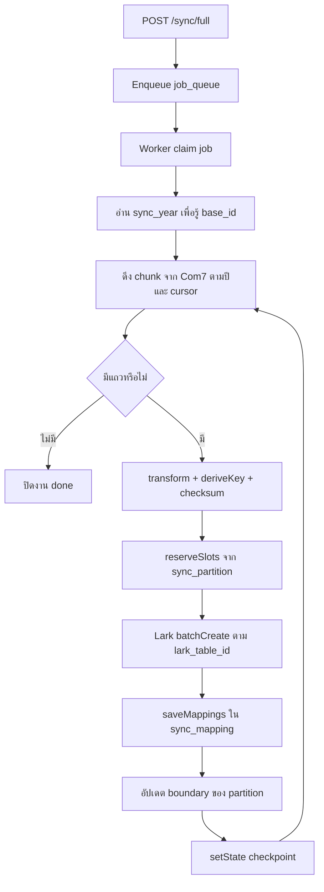
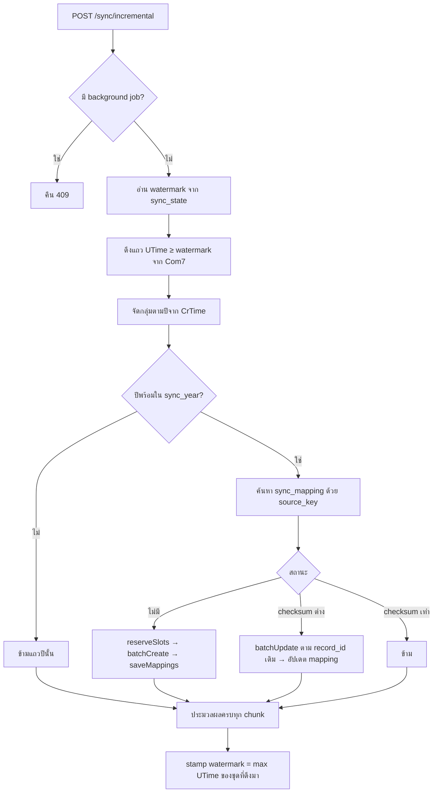

# เอกสารกระบวนการทำงานของระบบ (Workflow)

เอกสารนี้อธิบายภาพรวมว่าบริการซิงก์ Com7 → LarkBase ทำงานอย่างไร ตามลำดับการไหลของข้อมูลจริงในระบบ ไม่ใช่รายละเอียดสัญญา API

เอกสารที่เกี่ยวข้อง:

| เอกสาร | เนื้อหา |
|---|---|
| [api-overview.md](./api-overview.md) | หน้าที่ของแต่ละเส้นทาง API |
| [api-reference.md](./api-reference.md) | รูปแบบคำขอและการตอบกลับ |
| [sync-architecture.md](./sync-architecture.md) | การตัดสินใจด้านสถาปัตยกรรมและข้อจำกัด |

---

## 1. วัตถุประสงค์ของระบบ

ระบบนี้ทำหน้าที่ซิงก์ข้อมูลการขายจากฐานข้อมูล Com7 ไปยัง LarkBase ในทิศทางเดียว (one-way) เพื่อให้ข้อมูลบน Lark สอดคล้องกับข้อมูลต้นทางอย่างต่อเนื่อง

ระบบ **ไม่อ่านเรคอร์ดจาก Lark เพื่อหาตำแหน่งจัดเก็บในเส้นทางซิงก์ปกติ** แต่ใช้ฐานข้อมูลปฏิบัติการ (ops) เป็นตัวชี้ตำแหน่งทั้งหมด

---

## 2. ส่วนประกอบหลัก

```
┌─────────────────┐     อ่านอย่างเดียว      ┌──────────────────┐
│  Com7 MySQL     │ ──────────────────────► │  Sync Service    │
│  (instance A)   │                         │  API + Worker    │
│  itec /         │                         └────────┬─────────┘
│  itec-today     │                                  │
└─────────────────┘                                  │
                                                     │ อ่าน/เขียน
                                                     ▼
                                            ┌──────────────────┐
                                            │  Ops MySQL       │
                                            │  (instance B)    │
                                            │  sync_year       │
                                            │  sync_partition  │
                                            │  sync_mapping    │
                                            │  sync_state      │
                                            │  job_queue       │
                                            └──────────────────┘
                                                     │
                         เขียน batch create/update    │
                                                     ▼
                                            ┌──────────────────┐
                                            │  LarkBase        │
                                            │  1 base = 1 ปี   │
                                            │  ตาราง itec_NNN  │
                                            └──────────────────┘
```

| ส่วนประกอบ | บทบาท |
|---|---|
| **Com7 MySQL** | แหล่งข้อมูลต้นทาง อ่านอย่างเดียว |
| **Ops MySQL** | เก็บแผนที่ปี → base, พาร์ทิชัน → ตาราง Lark, และ mapping ของแต่ละแถว |
| **API (Express)** | รับคำสั่งจัดเตรียม / ซิงก์ / ตรวจสอบ |
| **Worker** | ดึงงานจาก `job_queue` แล้วประมวลผล backfill หรืองานล้างข้อมูล |
| **LarkBase** | ที่เก็บข้อมูลปลายทาง จำกัดประมาณ 20,000–50,000 แถวต่อตาราง จึงแบ่งเป็นหลายตารางต่อปี |

---

## 3. แนวคิดสำคัญที่ใช้ตลอดทั้งระบบ

### 3.1 การตัดปีจาก `CrTime`

แต่ละแถวถูกจัดเข้า base ตามปีของ `CrTime` (เวลาสร้าง ซึ่งไม่เปลี่ยนแปลง) ไม่ใช่ตาม `UTime` (เวลาแก้ไข)

ผลคือ แถวที่ถูกแก้ไขภายหลังจะไม่ย้ายไป base ปีอื่น

### 3.2 รหัสระบุแถวต้นทาง (`source_key`)

ระบบสร้างคีย์ระบุตัวตนของแถวจาก Com7 ดังนี้

```text
source_key = SellBranch|SellID|RowNo
```

คีย์นี้ถูกใช้เป็นคีย์หลักร่วมกับปีในตาราง `sync_mapping` เพื่อผูกกับ `lark_record_id` บน Lark

### 3.3 พาร์ทิชัน (`sync_partition`)

แต่ละปีมีตารางพาร์ทิชันหลายตารางบน Lark เช่น `itec_001`, `itec_002`, …

ตาราง `sync_partition` ใน ops เก็บอย่างน้อยดังนี้

| คอลัมน์ | ความหมาย |
|---|---|
| `year` | ปี (ค.ศ.) |
| `partition_no` | ลำดับพาร์ทิชัน |
| `lark_table_id` | รหัสตารางบน Lark |
| `fill_count` | จำนวนช่องที่จองไว้แล้วในพาร์ทิชันนั้น |

เมื่อต้องการเขียนแถวใหม่ ระบบจะ **จองช่อง** (`reserveSlots`) จากพาร์ทิชันที่ยังไม่เต็ม เพื่อรู้ว่าจะยิงไปตารางใด

### 3.4 Mapping (`sync_mapping`)

หลังเขียน Lark สำเร็จ ระบบบันทึกความสัมพันธ์ของแต่ละแถวใน ops

| ข้อมูลที่เก็บ | ใช้ทำอะไร |
|---|---|
| `year` + `source_key` | คีย์หลัก กันซ้ำ |
| `base_id` | base ที่แถวอยู่ |
| `partition_no` / `lark_table_id` | ตารางที่แถวอยู่ |
| `lark_record_id` | รหัสเรคอร์ดบน Lark สำหรับอัปเดตครั้งถัดไป |
| `checksum` | จับว่าข้อมูลต้นทางเปลี่ยนหรือไม่ |
| `cr_time` / `u_time` | เวลาสร้างและอัปเดตหลังแปลงเป็นค.ศ. |

---

## 4. วงจรชีวิตโดยรวม

```text
[1] จัดเตรียมปี
    POST /base/init
    → สร้างตารางพาร์ทิชันบน Lark
    → บันทึก sync_year + sync_partition ใน ops

[2] เติมข้อมูลครั้งแรก (Full Sync / Backfill)
    POST /sync/full → job_queue → Worker
    → ดึงข้อมูลทั้งปีจาก Com7 เป็นชิ้น ๆ
    → จองพาร์ทิชัน → batch create บน Lark → บันทึก mapping
    → วนซ้ำจนครบปี

[3] ซิงก์ต่อเนื่อง (Incremental)
    POST /sync/incremental (ยิงเป็นระยะ)
    → ดึงเฉพาะแถวที่ UTime ≥ watermark
    → แทรก / อัปเดต / ข้าม ตาม mapping
    → เลื่อน watermark

[4] ตรวจสอบและซ่อมแซม (เมื่อจำเป็น)
    GET /sync/full/check → POST /sync/full/heal
```

---

## 5. Workflow: Full Sync (เติมข้อมูลทั้งปี)

ใช้เมื่อต้องการนำข้อมูลทั้งปีขึ้น Lark ครั้งแรก หรือหลังล้างข้อมูลแล้วสร้างใหม่

### 5.1 ลำดับขั้นตอนแบบสรุป

```text
1. API รับคำสั่ง POST /sync/full
2. สร้างงานใน job_queue (type = full_sync)
3. Worker เคลมงาน
4. สำหรับแต่ละ chunk ของข้อมูล:
   a. ดึงข้อมูลจาก Com7 (itec) ตามปี + cursor
   b. แปลงรูปแบบ (พ.ศ. → ค.ศ., สร้าง source_key + checksum)
   c. จองช่องใน sync_partition → ได้ base / table / จำนวนช่อง
   d. เรียก Lark API batch create ตามตารางที่จองไว้
   e. บันทึก sync_mapping (source_key ↔ lark_record_id)
   f. อัปเดตขอบเขตพาร์ทิชัน (first/last) หากจำเป็น
   g. บันทึก checkpoint ใน sync_state
5. วนซ้ำจนไม่มีข้อมูลเหลือ → ปิดงาน
```

### 5.2 แผนภาพ Flow



### 5.3 รายละเอียดแต่ละขั้นในลูป

#### (ก) ดึงข้อมูลจาก Com7

- อ่านจากตาราง `itec` ของปีที่ระบุ
- แบ่งเป็นชิ้นด้วย cursor `(SellID, RowNo)` เพื่อให้ resume ได้เมื่อ worker หยุดกลางทาง
- ขนาดชิ้นอ้างอิง `chunkSize` (ค่าเริ่มต้นประมาณ 1,000 แถว)

#### (ข) แปลงและสร้างตัวระบุ

- แปลงวันที่จาก พ.ศ. เป็น ค.ศ. ตามมาตรฐานของระบบ
- สร้าง `source_key` จาก `deriveKey`
- คำนวณ `checksum` จากเนื้อหาหลังแปลง เพื่อใช้ตรวจการเปลี่ยนแปลงภายหลัง

#### (ค) เลือก base และตารางปลายทาง

1. อ่าน `sync_year` → ได้ `base_id` ของปีนั้น
2. เรียก `reserveSlots({ year, count })` บน `sync_partition`
3. ระบบเลือกพาร์ทิชันที่ยังมีที่ว่าง (`fill_count` ยังไม่ถึงความจุ)
4. เพิ่ม `fill_count` เพื่อจองช่องล่วงหน้า
5. ได้รายการ segment ซึ่งแต่ละ segment ระบุ
   - `partition_no`
   - `lark_table_id`
   - จำนวนแถวที่ต้องเขียนในตารางนั้น

หาก batch หนึ่งคร่อมสองพาร์ทิชัน (พาร์ทิชันเดิมใกล้เต็ม) ระบบจะแยกยิง Lark ตามตารางอัตโนมัติ

#### (ง) ยิง Lark API แบบ batch insert

- เรียก `batchCreate` ไปยัง base และ table ที่จองไว้
- Lark คืนรายการ `record_id` ตามลำดับอินพุต
- ระบบไม่ต้องอ่านตาราง Lark กลับมาเพื่อจับคู่แถว

#### (จ) อัปเดต ops: mapping และสถานะ

บันทึกลง `sync_mapping` อย่างน้อยดังนี้

- ปี
- `source_key` (คีย์หลักร่วมกับปี)
- `base_id`
- `partition_no` / `lark_table_id`
- `lark_record_id`
- `checksum`
- `cr_time` / `u_time`

จากนั้นอัปเดต

- ขอบเขต first/last ของพาร์ทิชัน (ถ้ามี)
- `sync_state` scope `full_sync:{year}` ด้วย checkpoint ของ cursor ล่าสุด

จากนั้นวนกลับไปดึง chunk ถัดไป จนกว่าแหล่งข้อมูลจะหมด

### 5.4 จุดสำคัญด้านความทนทาน

- **checkpoint ถูกเขียนทีหลังสุดของแต่ละ chunk** เพื่อไม่ให้ข้ามแถวเมื่อ crash
- หาก crash หลัง `batchCreate` แต่ก่อน checkpoint งานรอบถัดไปอาจสร้างเรคอร์ดซ้ำบน Lark แล้วชี้ mapping ไปที่เรคอร์ดใหม่ (เรคอร์ดเก่าอาจกลายเป็น orphan ซึ่งรับรู้ไว้ในข้อจำกัดของระบบ)

---

## 6. Workflow: Incremental Sync (ซิงก์ต่อเนื่อง)

ใช้หลัง backfill แล้ว เพื่อนำแถวใหม่และแถวที่แก้ไขขึ้น Lark เป็นระยะ

### 6.1 ลำดับขั้นตอนแบบสรุป

```text
1. ตรวจว่ามีงานเบื้องหลัง full_sync / hard_full_sync / clear_partitions หรือไม่
   → หากมี ให้ปฏิเสธด้วย 409
2. อ่าน watermark จาก sync_state scope = incremental
3. ดึงแถวจาก Com7 ที่ UTime ≥ watermark (itec ∪ itec-today)
4. คำนวณปีจาก CrTime ของแต่ละแถว
5. ปีที่ยังไม่ provision → ข้าม แต่ watermark ยังเลื่อนผ่าน
6. ปีที่พร้อม → แยกตามปี แล้วเทียบกับ sync_mapping
   - ไม่มี mapping        → จองพาร์ทิชัน + batchCreate + บันทึก mapping
   - มี mapping และ checksum เปลี่ยน → batchUpdate ตาม lark_record_id เดิม
   - มี mapping และ checksum เหมือนเดิม → ข้าม
7. เมื่อประมวลผลครบแล้ว ค่อยบันทึก watermark ใหม่ครั้งเดียว
```

### 6.2 แผนภาพ Flow



### 6.3 ความแตกต่างจาก Full Sync

| หัวข้อ | Full Sync | Incremental |
|---|---|---|
| แหล่งข้อมูล | ทั้งปีตาม cursor | เฉพาะที่ `UTime ≥ watermark` |
| การทำงาน | Worker + `job_queue` | ทำในคำขอ HTTP เดียวกัน |
| การเขียน Lark | โดยหลักเป็นการสร้างใหม่ | สร้างใหม่หรืออัปเดต |
| จุดอ้างอิง resume | checkpoint ต่อปีใน `sync_state` | watermark กลางใน `sync_state` scope `incremental` |
| การค้นหา record เดิม | ไม่จำเป็น (ยังไม่มี) | อ่านจาก `sync_mapping` เท่านั้น ไม่ดึงจาก Lark |

---

## 7. Workflow: การจัดเตรียมปี (Provision)

ก่อน full sync หรือ incremental ของปีใดปีหนึ่ง ปีนั้นต้องถูกจัดเตรียมแล้ว

```text
1. สร้าง base เปล่าในปีนั้นบน Lark ด้วยตนเอง
2. แชร์สิทธิ์ base ให้แอปพลิเคชันที่ระบบใช้
3. เรียก POST /base/init { year, base }
4. ระบบสร้างตารางพาร์ทิชันและฟิลด์บน Lark
5. บันทึก sync_year (year, base_id, status)
6. บันทึก sync_partition (year, partition_no, lark_table_id, fill_count = 0)
7. เมื่อครบแล้ว status = complete → พร้อมรับข้อมูล
```

---

## 8. สรุปลำดับการไหลของหนึ่งแถว (กรณีสร้างใหม่)

ภาพรวมที่ผู้ใช้ระบบมักอ้างถึงมีดังนี้

```text
ดึงแถวจาก Com7 DB
    ↓
แปลงข้อมูล + สร้าง source_key / checksum
    ↓
ดูปีจาก CrTime → อ่าน sync_year เพื่อรู้ base
    ↓
จองช่องใน sync_partition เพื่อรู้ว่าจะลงตาราง itec_NNN ใด
    ↓
เรียก Lark API batch create (หรือ batch update ถ้าเคยมี mapping)
    ↓
อัปเดต sync_mapping:
    - year + source_key (คีย์หลัก)
    - base_id / partition / lark_table_id
    - lark_record_id
    - checksum และเวลาที่เกี่ยวข้อง
    ↓
อัปเดตสถานะ (checkpoint ของ full sync หรือ watermark ของ incremental)
    ↓
วนซ้ำกับแถวถัดไป
```

---

## 9. ตารางอ้างอิงสถานะใน Ops

| ตาราง | บทบาทใน workflow |
|---|---|
| `sync_year` | บอกว่าปีใด map ไป base ใด และพร้อมใช้งานหรือยัง |
| `sync_partition` | บอกตารางปลายทางและจำนวนช่องที่จองแล้ว |
| `sync_mapping` | ผูกแถวต้นทางกับ `lark_record_id` เพื่ออัปเดตครั้งถัดไปโดยไม่ดึงจาก Lark |
| `sync_state` | เก็บ checkpoint ของ full sync และ watermark ของ incremental |
| `job_queue` | คิวงานเบื้องหลังสำหรับ full sync / hard-full / clear-partitions |

---

## 10. ข้อจำกัดที่ควรทราบในการอ่าน workflow นี้

1. ระบบเขียนไปยัง Lark อย่างเดียว ไม่เขียนกลับ Com7
2. เส้นทางซิงก์ปกติไม่ดึงเรคอร์ดจาก Lark เพื่อหา `record_id`
3. การซิงก์แบบ incremental จะถูกบล็อกชั่วคราว หากมีงาน `full_sync`, `hard_full_sync` หรือ `clear_partitions` กำลังรอหรือกำลังทำงาน
4. ปีที่ยังไม่ถูกจัดเตรียมจะถูกข้ามใน incremental และ watermark ยังเลื่อนผ่านแถวนั้น หากต้องการข้อมูลปีนั้นภายหลัง ต้องจัดเตรียมปีแล้วทำ full sync

---

## 11. API ของ Lark ที่โครงการนี้เรียกใช้

การเรียกทั้งหมดอยู่ภายใต้ `{LARK_BASE_DOMAIN}` (เช่น `https://open.larksuite.com`) และห่อไว้ใน `LarkGatewayHttp` / `tokenCache`  
เอกสารอ้างอิงรายละเอียดเพิ่มเติม: [lark-base-v3-api-notes.md](./superpowers/plans/lark-base-v3-api-notes.md)

โครงการใช้ API สองตระกูลร่วมกัน

| ตระกูล | ใช้เมื่อใด |
|---|---|
| `auth/v3` | แลกเปลี่ยน token |
| `base/v3` | จัดการตารางและฟิลด์ (provision / teardown) |
| `bitable/v1` | จัดการเรคอร์ด และ list ตารางเมื่อต้อง paginate |

### 11.1 การพิสูจน์ตัวตน

| วิธี | Endpoint | วัตถุประสงค์ในโครงการ |
|---|---|---|
| `POST` | `/open-apis/auth/v3/tenant_access_token/internal` | แลก `app_id` / `app_secret` เป็น `tenant_access_token` (cache ตามแอป) |

คำขอต่อไปส่งส่วนหัว `Authorization: Bearer {token}`

### 11.2 จัดการโครงสร้าง Base / ตาราง / ฟิลด์

ใช้ใน flow จัดเตรียมปี (`POST /base/init`) และรื้อพาร์ทิชัน (`POST /base/remove-partitions`)

| วิธี | Endpoint | ฟังก์ชันภายใน | วัตถุประสงค์ |
|---|---|---|---|
| `GET` | `/open-apis/base/v3/bases/{baseId}/tables?page_size=1` | `getBase` | ตรวจว่า base มีอยู่และแอปเข้าถึงได้ |
| `GET` | `/open-apis/bitable/v1/apps/{baseId}/tables` | `listTables` | รายการตารางทั้งหมด (มี pagination; `base/v3` list จำกัด 20 รายการ) |
| `POST` | `/open-apis/base/v3/bases/{baseId}/tables` | `createTable` | สร้างตารางพาร์ทิชันพร้อมฟิลด์ |
| `DELETE` | `/open-apis/base/v3/bases/{baseId}/tables/{tableId}` | `deleteTable` | ลบตารางพาร์ทิชัน |
| `GET` | `/open-apis/base/v3/bases/{baseId}/tables/{tableId}/fields` | `listFields` | อ่านรายชื่อฟิลด์ของตาราง |
| `POST` | `/open-apis/base/v3/bases/{baseId}/tables/{tableId}/fields` | `createField` | เพิ่มฟิลด์ในตาราง |

### 11.3 จัดการเรคอร์ด (เส้นทางซิงก์และซ่อมแซม)

| วิธี | Endpoint | ฟังก์ชันภายใน | วัตถุประสงค์ | ใช้ใน workflow |
|---|---|---|---|---|
| `POST` | `/open-apis/bitable/v1/apps/{baseId}/tables/{tableId}/records/batch_create` | `batchCreate` | สร้างเรคอร์ดเป็นชุด (ลำดับ `record_id` ตามอินพุต; ความจุสูงสุดประมาณ 1,000 ต่อครั้ง) | Full sync, Incremental (แถวใหม่) |
| `POST` | `/open-apis/bitable/v1/apps/{baseId}/tables/{tableId}/records/batch_update` | `batchUpdate` | อัปเดตเรคอร์ดตาม `record_id` เดิม | Incremental (checksum เปลี่ยน) |
| `POST` | `/open-apis/bitable/v1/apps/{baseId}/tables/{tableId}/records/batch_delete` | `batchDelete` | ลบเรคอร์ดเป็นชุด (สูงสุด 500 รหัสต่อครั้ง) | Hard-full, Clear-partitions, Heal |
| `GET` | `/open-apis/bitable/v1/apps/{baseId}/tables/{tableId}/records?page_size=1` | `countRecords` | อ่าน `data.total` เพื่อนับจำนวนเรคอร์ดในตาราง (ราคาถูก 1 ครั้งต่อตาราง) | Check, heal ช่องว่าง reservation |
| `GET` | `/open-apis/bitable/v1/apps/{baseId}/tables/{tableId}/records` | `listRecordIds` | ดึง `record_id` ทั้งหมดในตาราง (paginate) | Check/Heal ชั้นลึก, การล้างปี — **ห้ามใช้ในเส้นทางซิงก์ปกติ** |

### 11.4 สรุปตาม workflow ของบริการ

| Workflow ของบริการ | Lark API ที่เกี่ยวข้อง |
|---|---|
| `POST /base/init` | `getBase`, `listTables`, `createTable` (+ `listFields` / `createField` ตามกรณี) |
| `POST /base/remove-partitions` | `listTables`, `deleteTable` |
| Full sync (`POST /sync/full` + worker) | `tenant_access_token`, `countRecords` (self-heal), `batchCreate` |
| Incremental (`POST /sync/incremental`) | `batchCreate`, `batchUpdate` |
| Check / Heal | `countRecords`, `listRecordIds`, `batchCreate` / `batchDelete` (ตามผลการซ่อม) |
| Hard-full / Clear-partitions | `listRecordIds`, `batchDelete` (+ hard-full ตามด้วย full sync ซึ่งใช้ `batchCreate`) |

### 11.5 หมายเหตุการเรียก

1. คำสั่งที่เขียนข้อมูล (`batchCreate` / `batchUpdate` / `batchDelete` / `createTable` / `deleteTable` / `createField`) มีการลองใหม่เมื่อได้รหัส rate-limit เช่น `1254290`, `1254291`, `800004135`
2. เส้นทางซิงก์ประจำวันใช้ `batchCreate` / `batchUpdate` ร่วมกับ `sync_mapping` เป็นหลัก และหลีกเลี่ยง `listRecordIds`
3. `batchCreate` ใช้ `bitable/v1` ไม่ใช้ `base/v3` เพราะความจุต่อครั้งสูงกว่า (ประมาณ 1,000 เทียบกับประมาณ 200)
